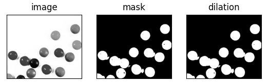
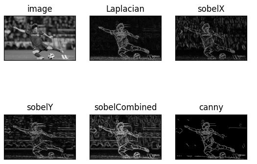
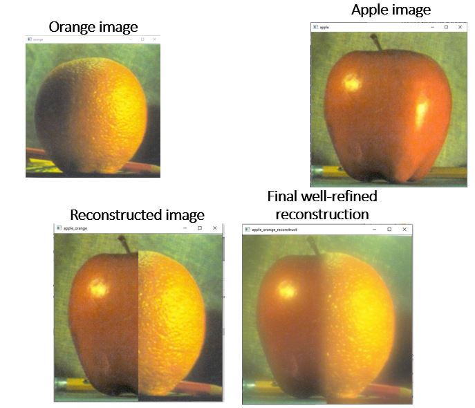
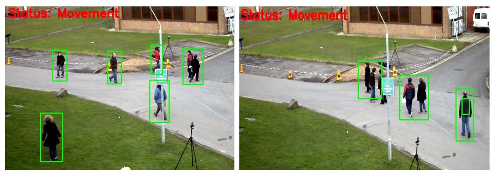
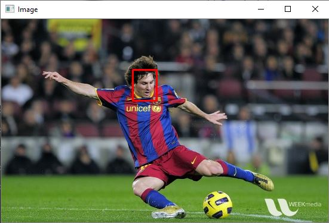
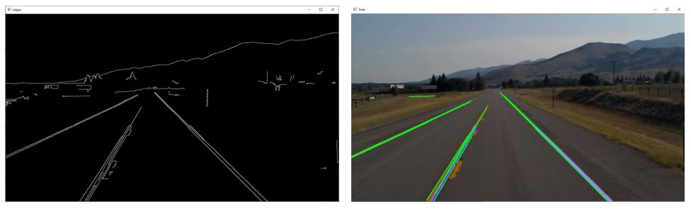
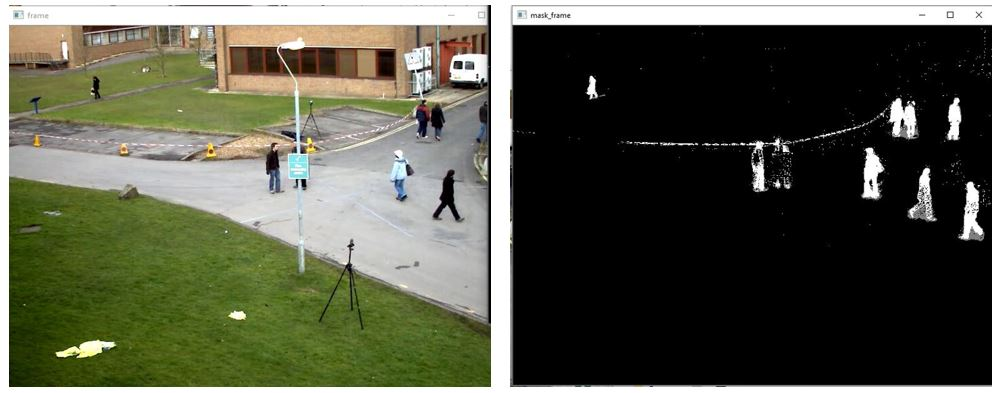
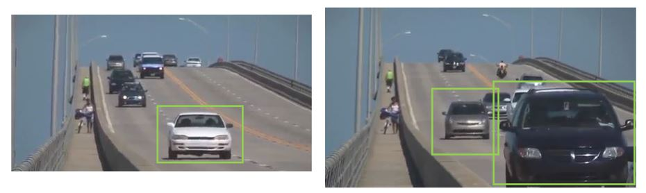

# OpenCV
Application of OpenCV library for Computer Vision tasks

OpenCV (Open Source Computer Vision Library) is an open-source computer vision and machine learning software library. It provides developers with a wide range of algorithms and tools for processing and analyzing images and video in real-time.

OpenCV includes a variety of features such as face detection, object recognition, optical character recognition (OCR), and tracking algorithms. It also provides image and video processing functions such as color space conversions, filtering, and transformation.

OpenCV is written in C++, but it also has interfaces for other programming languages including Python, Java, and MATLAB. This makes it a popular choice for developers working in various domains such as robotics, automation, and computer vision research.

*** 
### Thresholding
A simple digital image processing technique of segmenting images into grayscale and binary images.

***
### Edge detection
Edge detection uses variety of mathematical methods to identify sharp changes in image brightness or discontinuities in pixel ranges.

***
### Smoothing
Smoothing applies approximation functions which captures important patterns in data, while eliminating.

***
### Bounding Box
Use of the identification and enclosing of region of interest in pattern recognition and object identification.

***
### Template Matching
Template matching is a technique in digital image processing for finding small parts of an image which match a template image, such as matching the head image of the footballer Messi to a complete image of him.

***
### Hough Transform
Hough transform is a feature extraction technique used in image analysis, computer vision, and digital image processing. A good example is the road line detection below which could be iseful for control theory in driverless cars.

***
### Background Subtraction
Background subtraction is a technique which allows an image's foreground to be extracted from its background for further processing. Applicaple in the field of object recognition and image reconstruction.

***
### Meanshift
An application of meanshift for car identification and detection in a live video 

